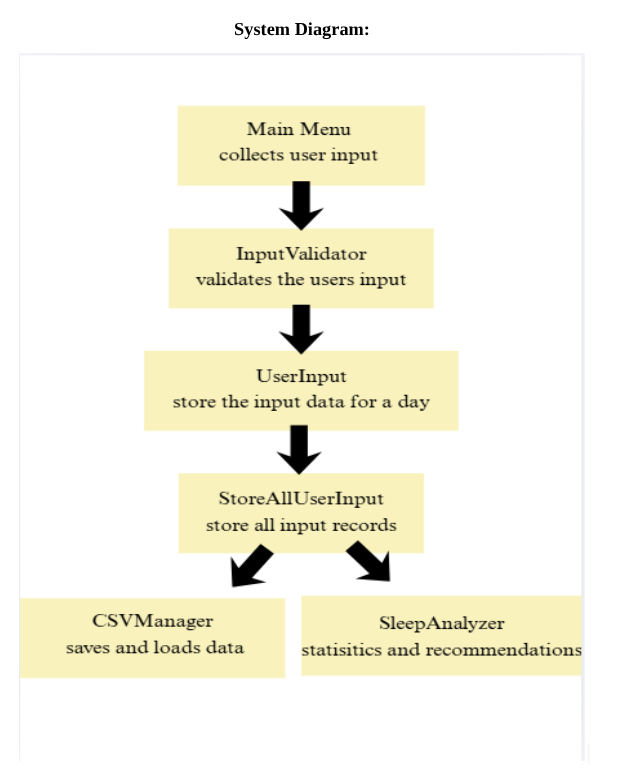

# CS2114 Project 1 Group 68

# Sleepify

## Team Members
- CarolineCollier
- Yug Patel
- Catherine Arockia
- Cassandra Dragulescu

## System Diagram


## How to Compile

1. Download or clone the repository.
2. Open a terminal or command prompt in the project directory.
3. Compile all Java source files:

```bash
javac *.java
```
4. Then run the MainMenu.java class

## Link for this repo 
[Sleepify Repo](https://github.com/cdragu6519/cs2114-project1-group68)


